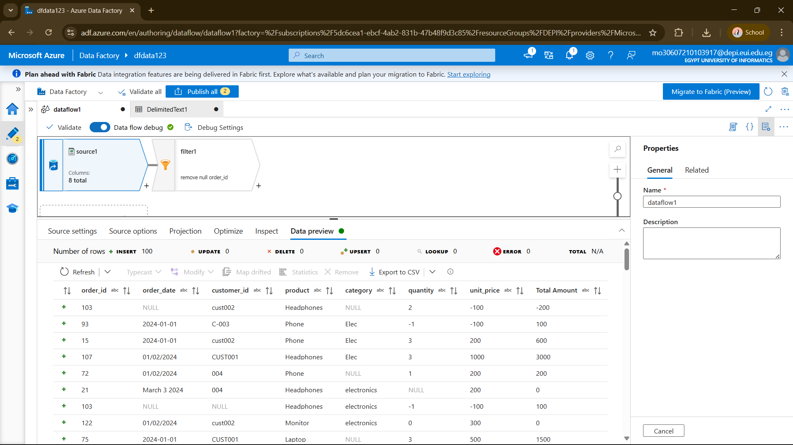
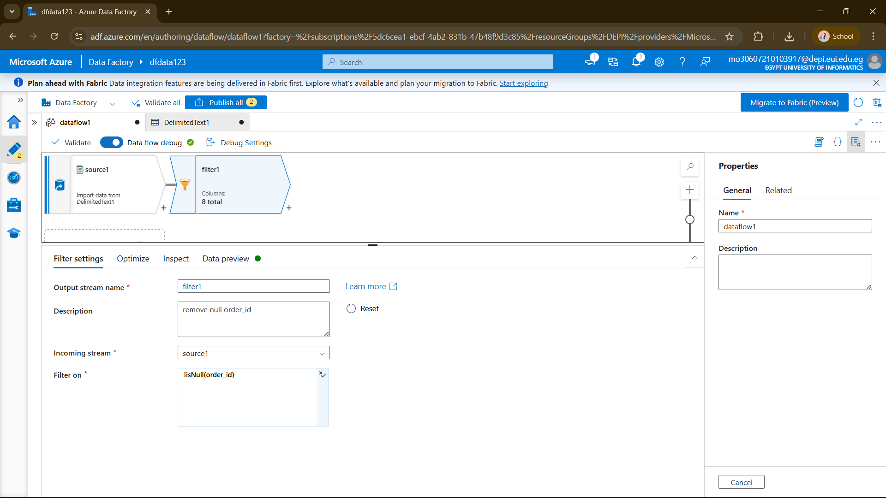
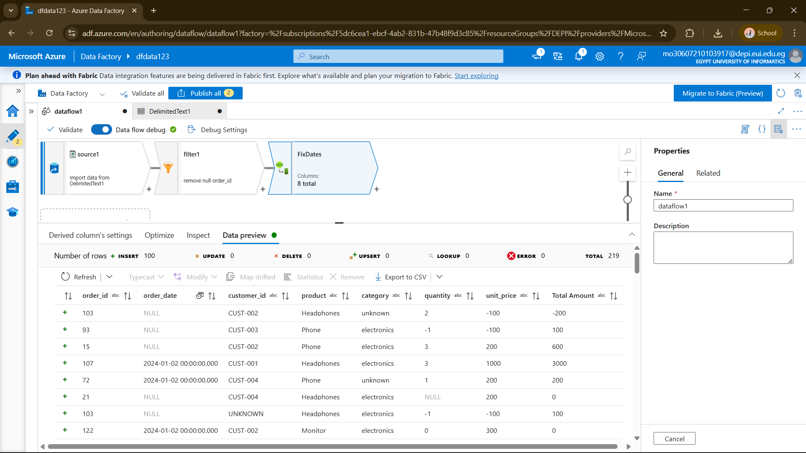
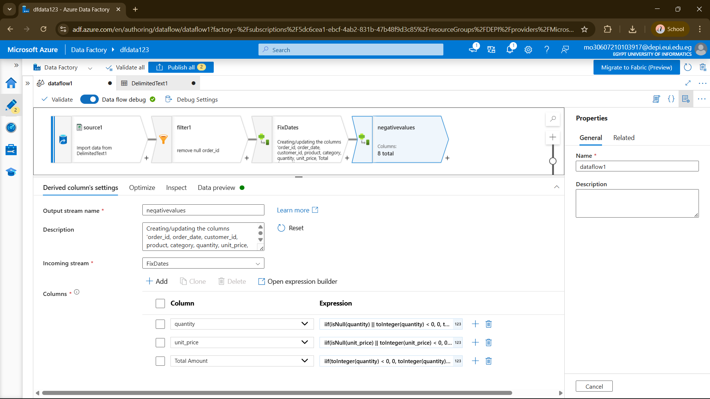
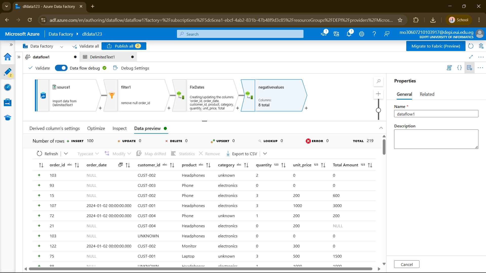
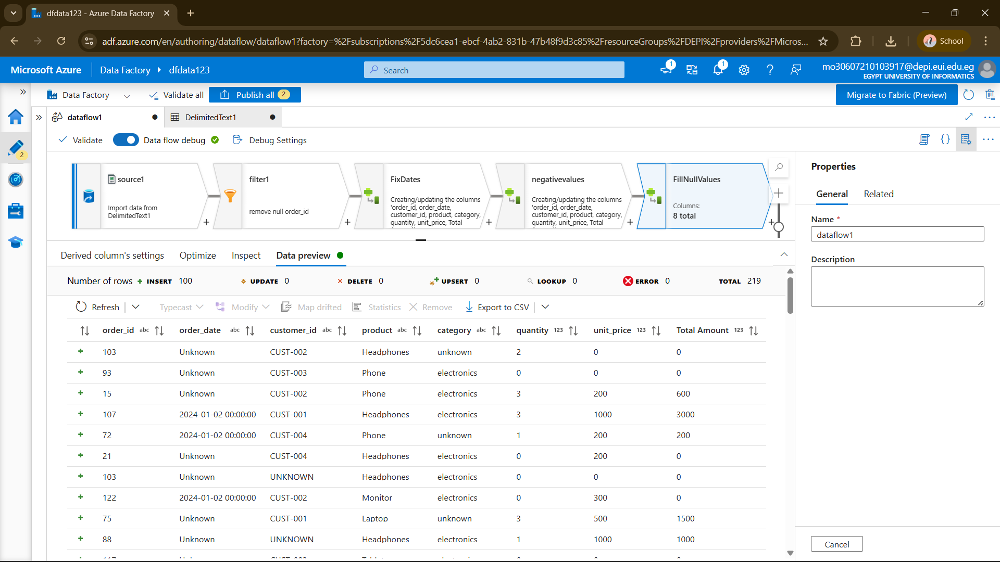
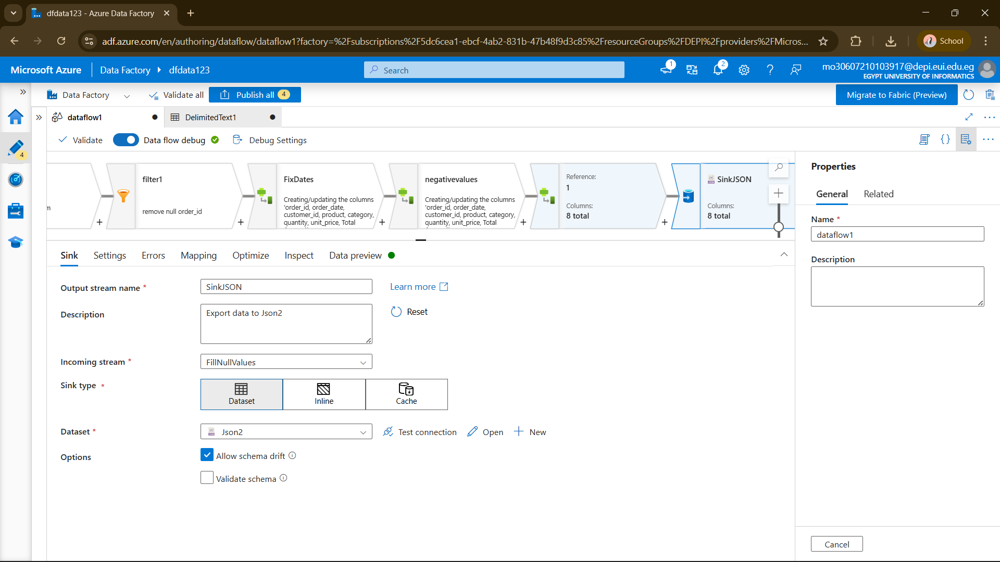
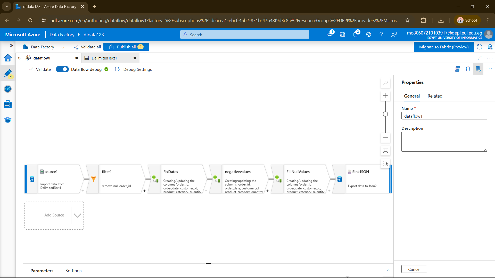
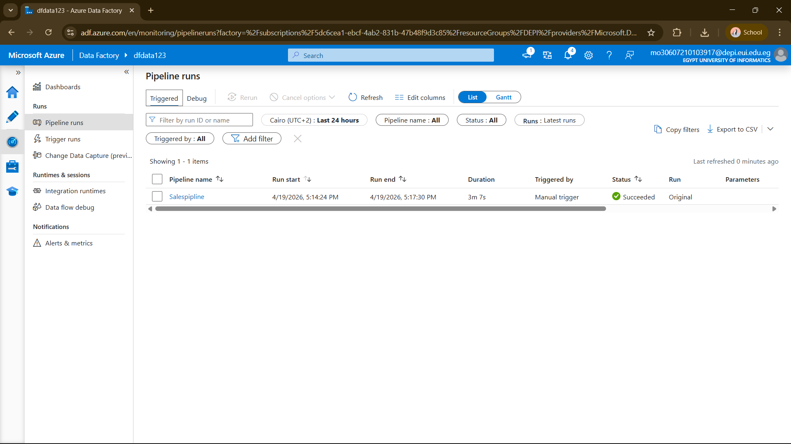
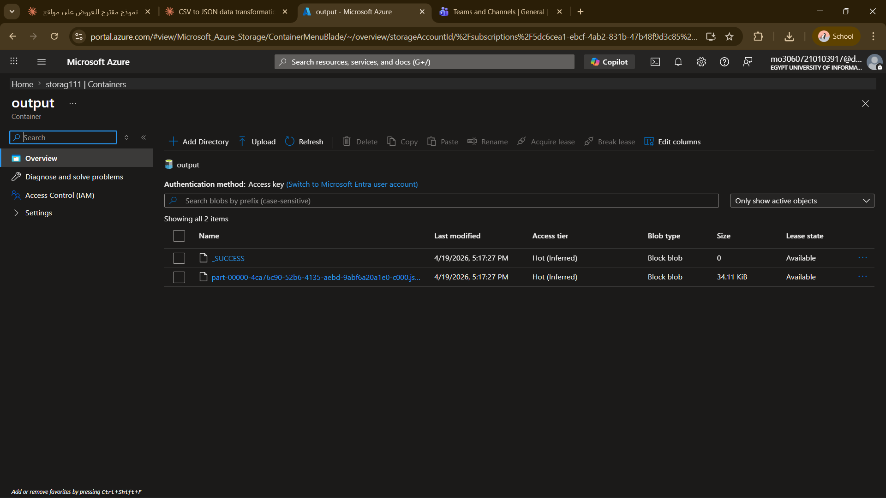

# 🏭 Azure Data Factory — Sales CSV to JSON Pipeline

A data engineering project built with **Azure Data Factory** that reads a raw `sales.csv` file, applies data cleaning transformations using a Mapping Data Flow, and saves the cleaned output as a **JSON file** in Azure Data Lake Storage Gen2.

---

## 📋 Project Overview

| Item | Details |
|------|---------|
| **Tool** | Azure Data Factory (ADF) |
| **Source** | `sales.csv` — Azure Data Lake Storage Gen2 (`input` container) |
| **Output** | `sales_cleaned.json` — Azure Data Lake Storage Gen2 (`output` container) |
| **Rows Processed** | 219 rows (after removing nulls) |
| **Pipeline Status** | ✅ Succeeded (3m 7s) |

---

## 🔍 Data Issues Found in Raw CSV

The raw `sales.csv` had several quality issues that needed fixing:

- ❌ Null `order_id` rows
- ❌ Inconsistent date formats (`1/1/2024` vs `March 3 2024`)
- ❌ Inconsistent `category` values (`Elec`, `electronics`, `Electronics`)
- ❌ Inconsistent `customer_id` formats (`cust002`, `CUST001`, `C-003`, `004`)
- ❌ Negative values in `quantity` and `unit_price`
- ❌ Incorrect `Total Amount` (not matching quantity × unit_price)
- ❌ Null values in `product`, `order_date`, and other columns

---

## 🔄 Data Flow Pipeline

The pipeline consists of **6 connected steps**:

```
source1 → filter1 → FixDates → negativevalues → FillNullValues → SinkJSON
```

### Step 1 — Source (`source1`)
Reads `sales.csv` from the `input` container in Azure Data Lake Storage Gen2.



---

### Step 2 — Filter (`filter1`)
Removes all rows where `order_id` is null.

**Expression:**
```
!isNull(order_id)
```



---

### Step 3 — Derived Column (`FixDates`)
Standardizes dates, category values, and customer IDs.

**Expressions:**
```
order_date   → toDate(toString(order_date), ['M/d/yyyy','MMMM d yyyy'])
category     → lower(trim(iif(isNull(category),'unknown', iif(category=='Elec','electronics',category))))
customer_id  → iif(isNull(customer_id),'UNKNOWN',
                 iif(customer_id=='004','CUST-004',
                 iif(customer_id=='C-003','CUST-003',
                 iif(customer_id=='CUST001','CUST-001',
                 iif(customer_id=='cust002','CUST-002', customer_id)))))
```



---

### Step 4 — Derived Column (`negativevalues`)
Replaces negative and null values in `quantity` and `unit_price` with `0`, then recalculates `Total Amount`.

**Expressions:**
```
quantity      → iif(isNull(quantity) || toInteger(quantity) < 0, 0, toInteger(quantity))
unit_price    → iif(isNull(unit_price) || toInteger(unit_price) < 0, 0, toInteger(unit_price))
Total Amount  → iif(toInteger(quantity) < 0, 0, toInteger(quantity))
                * iif(toInteger(unit_price) < 0, 0, toInteger(unit_price))
```





---

### Step 5 — Derived Column (`FillNullValues`)
Fills remaining null values with meaningful defaults.

**Expressions:**
```
product      → iif(isNull(product), 'Unknown', product)
order_date   → iif(isNull(order_date), 'Unknown', toString(order_date))
Total Amount → iif(isNull({Total Amount}), 0, {Total Amount})
```



---

### Step 6 — Sink (`SinkJSON`)
Saves the cleaned data as a JSON file into the `output` container in Azure Data Lake Storage Gen2.



---

### 🗺️ Full Data Flow Canvas



---

## ▶️ Pipeline Run

The pipeline was triggered manually and completed successfully.

| Field | Value |
|-------|-------|
| Pipeline Name | `Salespipline` |
| Run Start | 4/19/2026, 5:14:24 PM |
| Run End | 4/19/2026, 5:17:30 PM |
| Duration | 3m 7s |
| Triggered By | Manual trigger |
| Status | ✅ Succeeded |



---

## 📦 Output

The cleaned JSON file was saved successfully to the `output` container.

| File | Size | Modified |
|------|------|----------|
| `part-00000-...json` | 34.11 KiB | 4/19/2026, 5:17:27 PM |
| `_SUCCESS` | 0 bytes | 4/19/2026, 5:17:27 PM |



---

## 🛠️ Technologies Used

- **Azure Data Factory** — Pipeline & Data Flow
- **Azure Data Lake Storage Gen2** — Source & Sink storage
- **Mapping Data Flow** — Visual data transformation
- **JSON** — Output format

---
